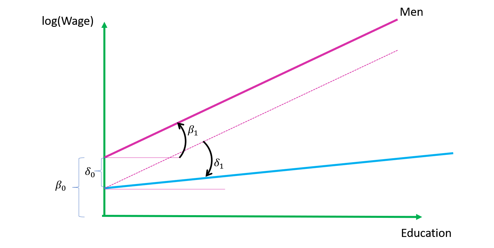
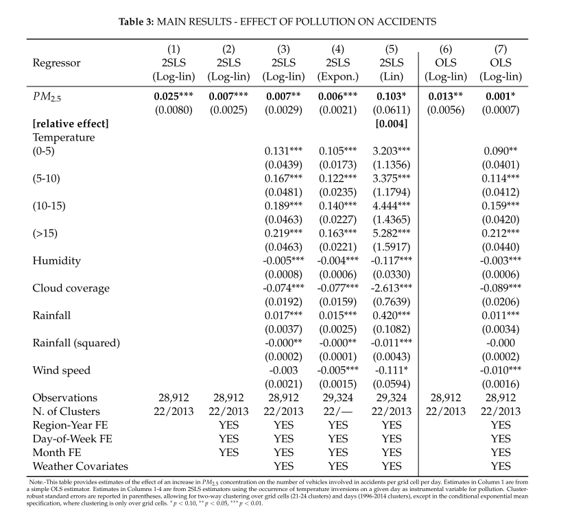
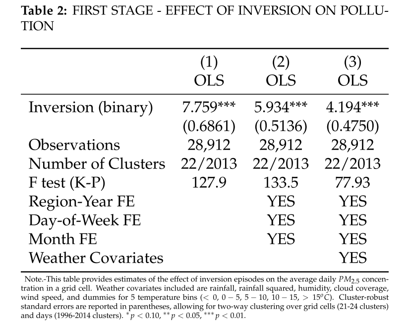
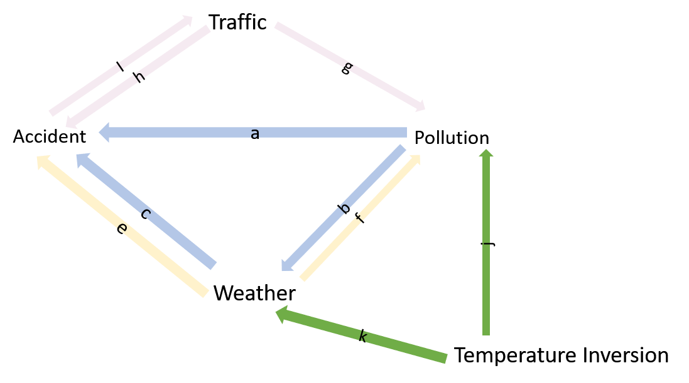
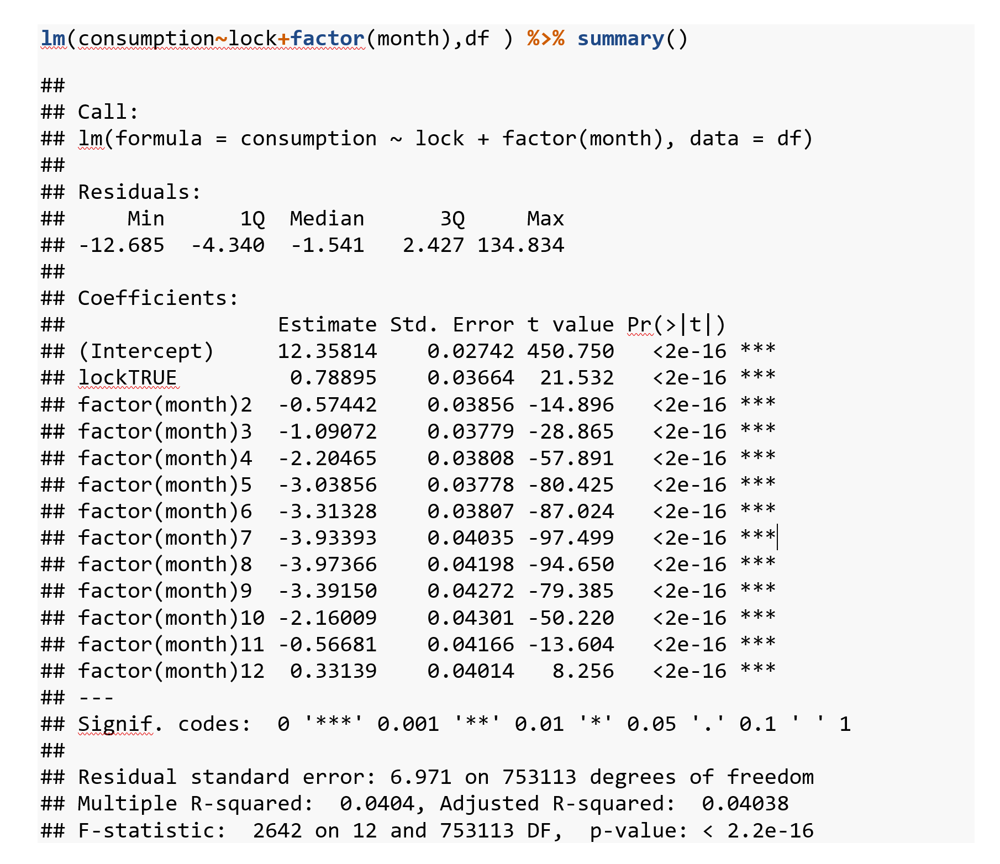
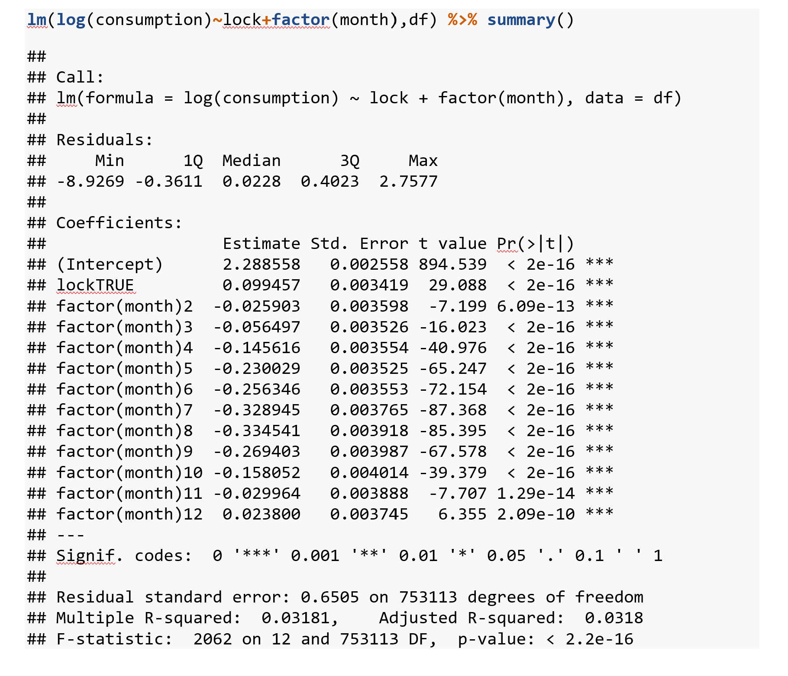
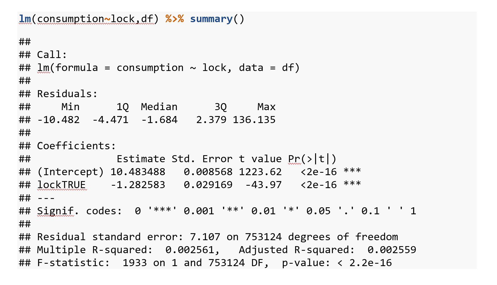

```{r setup, include = FALSE, message=FALSE}
library("webexercises")
library(ggplot2)
#knitr::opts_chunk$set(fig.path='../../images/')
```


```{r  fig.width=30,echo=F,preview=TRUE,out.width = '80%'}

```


# Exercise 10.1


(a) Suppose you estimate the gender difference in returns to education using the following mode:

$$log(wage)=(\beta_0+\delta_0 female)+(\beta_1+\delta_1 female) \times educ + u$$
where wage is the hourly wage, female is a gender dummy, which is equal 1 
if the individual is female, and educ is the number of years of education. 
Provide an interpretation if $δ_0<0$ and $δ_1<0$.


`r hide("Answer:")`

<br>
This is a linear model where the intercept men is $\beta_0$ and for women is $\beta_0+\delta_0 female$. The change in log wages for men is $\beta_1$ whereas for women it is $\beta_1+\delta_1 female$. Also note that because we have log wage as dependent variable, these coefficients can be interpreted as percentage changes in wage.
If $δ_0<0$ and $δ_1<0$, this means that women earn less for a given level of education and also that the change in wage for a given change in education (i.e. the returns to education) are lower for women.


The figure below illustrates this model:
{width=100%}
Note that $\beta_1$ represents the slope of the line for men whereas $\delta_1$ reperesents how much less the line for women is sloped compared to men.

`r unhide()`


(b) Someone asserts that expected wages are the same for men and women who have the same level of education. Referring to the model in part (a), what would be your null hypothesis to test this? How you would test it. 


`r hide("Answer:")`
This would require the joint hypothesis: $δ_0=0$ & $δ_1=0$. This can be implemented via a joint (F-) test; e.g. in R this can be done with the linearHypothesis Command.
`r unhide()`


(c) Suppose your estimation returns the following values for the model from part (a):  
$\hat{δ}_0=-0.1$,  $\hat{δ}_1=-0.01$. Based on this, what is the expected wage differential between a man and a woman with 10 years of schooling? 


`r hide("Hint:")`
Man with 10 years: $E\{log(wage)|Man\}=\beta_0+\beta_1 \times educ$ 

Women with 10 years:  $E\{log(wage)|Women\}=\beta_0+\delta_0+(\beta_1+\delta_1) \times educ$
`r unhide()`
<br>
`r hide("Answer:")`
The wage differential between a man an women with the same 10 years of education becomes
$$E\{log(wage)|Man,10years\} - E\{log(wage)|Women,10 years\}=-(\delta_0+\delta_1\times 10)$$
$$=0.1+10\times0.01=0.2$$
Thus we would expect the women to have a a 20% lower wage
`r unhide()`


(d) Suppose you find in addition that $β_1=0.01$. What does it imply about the effect of 5 years more of education on the expected wage of a woman? 

`r hide("Answer:")`
Consequently the effect of education on women's wages would become $β_1+\delta_1=0.01-0.01=0$. This would mean that education has no effect on women's wages.
`r unhide()`


(e)	Suppose we have estimated the following wage equation
$$W =10+10AGE-0.1AGE^2+ϵ$$
Based on this, at what age would we expect the highest wage?


`r hide("Answer:")`
The equation describes a hump shaped relationship between wages and age (since the squared term is negative). It therefore makes sense to find the top of the hump which will have an age gradient of 0. The gradient can be found by differentiating with respect to age: 
$$\frac{\partial W}{\partial AGE}=10-0.1\times 2 \times AGE$$
Thus setting $\frac{\partial W}{\partial AGE}$ equal to zero leads to 
$$AGE^{max.wage}=\frac{10}{0.1\times 2}=50$$
`r unhide()`


# Exercise 10.2

Consider the dataset [ets_thres_final.csv](https://www.dropbox.com/sh/rqmo1hvij1veff0/AAAnRCRpxRqV7LKu9nzt1SCea?dl=1). It contains emission figures (lnco2=log of CO2 emissions) for a sample of firms regulated by the European Emissions Trading System (EUETS) for the years from 2005 to 2017 although the firm identifiers have gone missing from the dataset. Note that an Emissions Trading System requires firms to buy permits for every unit of CO2 they emit. By restricting the total number of permits that are issued governments can control the total amount of emissions while allowing firms to trade permits freely so that they can be used with those businesses that find it hardest to reduce emissions. In the early days of the EU ETS (which started in 2005) permits where freely given to firms. This changed from 2013 onwards when permits where only given to certain firms and sectors that were deemed at risk from foreign competition. The variable `nonfree` indicates those firms in the dataset. According to economic theory the method of permits allocation should have no effect on the eventual emissions by firms (Independence hypothesis). Firms that have been given free permits will have an incentive to reduce emissions as that frees up permits to sell within the permit market. 

(a)	Examine this hypothesis by running a regression of lnco2 on the `nonfree` variable. Report what you find. 


`r hide("Answer:")`

```{r,include=FALSE,eval=FALSE}
library(magrittr)
library(dplyr)
df=read.csv("https://www.dropbox.com/s/yylc6ygkcrjir39/ets_thres_final.csv?dl=1")
df%<>%mutate(nonfree=(1-free)) #%>% select(-free)
write.csv(df,"../../../../data/ets_thres_final.csv")
```

```{r,echo=TRUE}
library(dplyr)
df=read.csv("https://www.dropbox.com/s/urro3ty46kr4f7z/ets_thres_final.csv?dl=1")
df=df %>% mutate(nonfree=factor(nonfree),period=factor(period))
head(df)

lm(lnco2~nonfree,df) %>% summary()
df %>% group_by(year) %>% summarise(n())


```
`r unhide()`


(b)	Provide an interpretation of the regression coefficient along with a discussion of the implications of your result. 

`r hide("Answer:")`
The firms that stop receiving free permits in 2013 pollute 50% less on average over the 2009 to 2017 period.
`r unhide()`


(c)	The variable period is a categorical variable equal to 1 for observations from before 2013 and equal to 2 for observations from year 2013 onward. Convert it into a factor variable and run a regression of lnco2 on period. Provide an interpretation of the estimated coefficients.

`r hide("Answer:")`


```{r,echo=TRUE}
lm(lnco2~period,df) %>% summary()

```


This shows that on average emission after 2012 are .16 percent lower than before 2013, a value that is not significantly different from zero.
`r unhide()`


(d)	Would you say your results in part (a) provide a causal estimate of the effect of not giving free permits?

`r hide("Answer:")`
The results in part a) confound the treatment effect with any - pre-existing - firm characteristics that might have influenced the allocation of permits. For instance it might well be that the most energy (and therefore pollution) intensive firms were given given an exemption from having to buy all their permits. Hence, firms who have to buy permits (`nonfree` firms) are those with lower CO2 consumption to begin with.

`r unhide()`

(e)	With the data at hand can you propose and implement an alternative regression approach that might address any concerns raised in (d)? If yes, implement this regression and discuss its results. What does the result tell you about the Independence hypothesis discussed in the introduction? 


`r hide("Answer:")`

In the dataset as it is there is actually no variable that properly captures the treatment we are interested in. `nonfree` identifies firms that are eventually treated (the treatment being the bitter pill of having to pay for all their permits) but it is equal to 1 also in periods when they are not treated. But it is easy to create a dummy variable, which is only equal to one for those firms that treated in periods when they are treated: we simply have to create a dummy variable that is only true for `nonfree` firms during period 2. Let's try that:

```{r,echo=TRUE}

df=df %>% mutate( period2Xnonfree= (nonfree==1) & ( as.character(period)=="2" ) )

lm(lnco2~period2Xnonfree,df) %>% summary()

```
At face value this would suggest that firms not receiving free permits leads to 41% less CO2 emissions.
However, there are at least 2 potential confounding factors:
1. The fact that firms still getting free permits have not been selected at random
2. There might be time effects present. For instance, after 2013 growth might have picked up following the recession of 2008.

We can control for the first issue by including `nonfree` as a control variable as (it measures how different the `nonfree` firms were before they were made to buy all permits). The second issue we can address with a period dummy variable. Hence:

```{r, echo=TRUE}
lm(lnco2~period+nonfree+period2Xnonfree,df) %>% summary()


```
Hence, this changes the the coefficient for period2Xfree quite a bit; i.e. it would suggest that nonfree permit allocation reduces emissions by 16% only.

An alternative way of implementing that is via the `:` operator which interacts (multiplies) variables "on the fly":


```{r , echo=TRUE}
fm=lm(lnco2~period+nonfree+period:nonfree,df) 
fm%>% summary()


```

It's also instructive to look at this graphically:

```{r,echo=FALSE}
library(scales)

p1free=fm[["coefficients"]][["(Intercept)"]]

p2free=fm[["coefficients"]][["(Intercept)"]]+
       fm[["coefficients"]][["period2"]]

p1nonfree=fm[["coefficients"]][["(Intercept)"]]+
  fm[["coefficients"]][["nonfree1"]]

p2nonfree=fm[["coefficients"]][["(Intercept)"]]+
  fm[["coefficients"]][["period2"]]+
  fm[["coefficients"]][["nonfree1"]]+
  fm[["coefficients"]][["period2:nonfree1"]]


```


```{r, echo=FALSE}
ggplot(df,aes(x=year,y=lnco2,color=nonfree))+geom_jitter(height=0,width=0.2)+
  scale_x_continuous(breaks= pretty_breaks())+
  geom_vline(xintercept =2012.5,color="orange",size=2)+
  
  geom_segment(aes(x=2008, xend=2012.5, y=p1free, yend=p1free), colour="red")+
  geom_segment(aes(x=2008, xend=2012.5, y=p1nonfree, yend=p1nonfree), colour="blue")+

  geom_segment(aes(x=2012.5, xend=2017, y=p2free, yend=p2free), colour="red")+
  geom_segment(aes(x=2012.5, xend=2017, y=p2nonfree, yend=p2nonfree), colour="blue")+

  scale_colour_manual(values = c("red", "blue", "green"),name="Non Free")


```

zooming in:
```{r,echo=FALSE}


```

```{r,echo=FALSE}
dfx=df %>% filter(abs(lnco2-9.5)<.5)

ggplot(dfx,aes(x=year,y=lnco2,color=nonfree))+geom_jitter(height=0,width=0.2)+
  scale_x_continuous(breaks= pretty_breaks())+
  geom_vline(xintercept =2012.5,color="orange",size=2)+
  
  geom_segment(aes(x=2008, xend=2012.5, y=p1free, yend=p1free), colour="red")+
  geom_segment(aes(x=2008, xend=2012.5, y=p1nonfree, yend=p1nonfree), colour="blue")+

  geom_segment(aes(x=2012.5, xend=2017, y=p2free, yend=p2free), colour="red")+
  geom_segment(aes(x=2012.5, xend=2017, y=p2nonfree, yend=p2nonfree), colour="blue")+

  
  scale_colour_manual(values = c("red", "blue", "green"),name="Non Free")


```


`r unhide()`


# Exercise 10.3


For this question use the dataset [hals1prep.csv](https://www.dropbox.com/s/1xg2an5qudcahhy/hals1prep.csv?dl=1), containing data from the UK Health and Lifestyle Survey (1984-85). In this survey, several thousand people in the UK were being asked questions about their health and lifestyle.

(a)	The variable bmi records the body mass index (BMI) of the respondents. The BMI uses the weight and height to work out whether a weight is healthy or if someone is overweight. A value between 18.5 and 24.9 indicates a healthy weight. Based on the information below, which region of the UK had – on average – the most overweight population? Run a regression of BMI on regional categories (recorded in the variable region). Use this to figure out in which UK regions are on average outside the healthy BMI range . 

`r hide("Answer:")`
```{r,echo=TRUE}
halsx=read.csv("https://mondpanther.github.io/datastorieshub/data/hals1prep.csv")
table(halsx$ownh)

table(halsx$region)
#summary(lm(bmi~ region, halsx))
summary(lm(bmi~0+ region, halsx))


```

If we drop the intercept by writing `0+...` the dummies represent the average BMI values. We that Wales has the highest, with both Scotland and Wales above 24.9 and all other regions within the healthy range.
`r unhide()`


b)	The variable ownh_num records responses to the question “Would you say that for someone of your age your own health in general is…” where users had the following response options:

•	Excellent (1)

•	Good (2)

•	Fair (3)

•	Poor (4)

The numbers in brackets indicate how these options were recorded in the `ownh_num` variable. Run a regression of `ownh_num` on `bmi` and provide a discussion of what you find. Is it in line with your expectations on this?

`r hide("Answer:")`
```{r, echo=TRUE}
lm(ownh_num~bmi , halsx) %>% summary()
```
An increase in the BMI by 1 unit increases the health score 0.014 units. Because a higher value of the score implies worse health this suggests a reduction in health which is line with expectations.

`r unhide()`

c)	Can you think of at least two reasons why the estimate in b) does not provide a correct representation of the causal relationship between bmi and health?   


`r hide("Answer:")`
There might be a variety of confounding factors; e.g. richer people might be healthier and less overweight because they can afford higher quality food (making them slimmer) as well as better medical care (making them healthier for reasons unrelated to food intake and weight). Hence, because in this scenario money is negatively correlated with both BMI and the onwnh_num health score this leads to an upward bias; i.e. the coefficient would be lower in reality than what we found.

Education might play a similar role; i.e. better educated people will be healthier for a range of reasons (e.g. knowledge about health and how get the best care) and the same knowledge might also allow them to eat better and gain less weight.

There might also be a direct reverse causality: people who are sicker might find it hard to exercise and/or make the effort of doing high quality cooking which would again lead to an upward bias in our regression.

However, note that one could imagine that this also goes the other way round: many diseases lead to extreme weight loss which would imply a downward bias in our regression.

Age might be an other issue. Most people get a bit fatter as they age (well at least I do). Now the question asks to consider age when answering the question. However, there might be a systematic bias in how people respond to such questions. E.g. suppose older people tend to get more content than younger people so that they are more often just happy with their health. This would mean that age has a negative effect (more healthy) on the dependent variable. At the same time there is a positive effect on BMI. This would mean a negative correlation between errors and omitted variable implying a downward bias.

Again the bias could go the other way round if for instance older people are more likely to become hypochondriacs.


`r unhide()`


d)	The dataset includes several additional control variables.  These include 

•	incomeB a categorical variable representing income brackets where “1” represents the lowest and “12” the highest income group.
•	agyrs – a variable recording the age of the participant

Include those in the regression of reported health from b) Discuss what the output suggests about the relationships between health and age, and health and income. Are they in line with what you would have expected? In each case can you provide an explanation for the kind of relationship found? 

Also discuss the usefulness of including both the age and income controls for estimating the causal effect of BMI. In each case discuss at least one reason for and one reason against including these controls.  [5 points]


`r hide("Answer:")`
```{r, echo=TRUE}
lm(ownh_num~bmi+agyrs+factor(incomeB) , halsx) %>% summary()


```
The health score for higher income bands is lower suggesting richer people tend to be healthier (or at least report to be healther). This is inline what we would expect: richer people can afford better health care, live in healthier houses, in better neighbourhoods with less pollution etc.

The relation between age and health seems a bit more surprising as it suggests that older people report being healthier. But we have to remind ourselves that the question asked “how is your health given your age”.  Hence, it could mean that older people lower their standards and are more content. 

Another more sinister explanation is the following: suppose each generation has some people that are inherently healthy (e.g. based on their genes) and other that more sickly. Clearly we would expect the healthier to be less likely to die and thereby get older. This would mean that even if people respond in exactly the same to the health question throughout their life the only old people remaining to respond to the survey are the ones that always responded as being in great health.

We would want to include those variables if there is concern regarding some of the biases discussed in part c). For that they do not only need to have an affect on the dependent variable (health score) but also cause some of the variation in the BMI explanatory variable. See part c) for a more elaborate discussion.

An important reason not to include those is if we think the causal chain goes the other way round; e.g. it could be that people who are overweight have
harder time in the job market making them poorer. Equally, being overweight might affect your chances of survival and thereby your age.

`r unhide()`


e)	Consider the R output below. It builds a new dataframe as a transformation the dataframe halsx with the health survey data. ownh_num is defined as in b). Can you provide an interpretation for the coefficients of the linear regression reported at the end of R output? Note that the rbind() command combines 
dataframes vertically .

```{r, echo=TRUE}
labels=c("excellent", "good", "fair", "poor")

for(i in 1:4){
  fr=halsx
  fr['dum']=fr$ownh_num==i
  fr['label']=labels[i]
  if(i==1){
     longframe=fr
  }
  else {
    
    longframe=rbind(longframe,fr)
  }
  
  print(nrow(longframe))

}  

summary(lm(dum~label,longframe))

```

`r hide("Answer:")`
The regression reports the share of responses to the health question in the data; i.e. from the intercept we can see that 20.6% of respondents report excellent health. (20.6+2.5)% respond that their health is fair and so on.


Why is this the case?

Firstly, note that the `for` loop creates a new dataframe (called `longframe`) that is basically 5 copies (one for each possible health status answer category) of the original dataframe `fr` glued together (that's what the command `rbind()` does; i.e. combining dataframes vertically).
The only thing that is different between the 5 dataframe copies is the newly created variable `dum`. It is equal to 1 if a respondent responds to the health survey in the way that corresponds to the answer category.
With that in mind you need to remember what we learned about dummy variables as dependent and explanatory variables. For instance we said that constant represents the average dependent variable for the reference group. So here this is the observations that are in the dataframe that was created for an response of "excellent" to the health question.
So we get the average for the dependent variable which is equal to one for those people who respondent "excellent". So that is the number of people responding "excellent" dividid by the number of people responding; i.e. the the share that have respondent excellent.
For the other groups the coefficient tells us how much higher (or lower) that share is.

`r unhide()`


# Exercise 10.4 {#pollution}

Air pollution has been shown to have a variety of adverse health effects. Recently, researchers have also started to investigate other negative effects. Below we report regression tables from a study that investigates a link between air pollution and car accidents.

(a)	Can you suggest a causal mechanism that might explain why air pollution could have an effect on car accidents?

`r hide("Answer:")`
Air pollution affects the respiratory system. If people cannot breathe so well that might eventually affect their brain. Drivers might consequently be less able to focus and therefore are more likely to cause accidents. Pollution could also cause poorer visibility that leads to accidents.
`r unhide()`

(b)	Table 3 below, extracted from an academic paper, reports various regressions of the log number of accidents per day across geographic grid cells for the UK over a period from 2009 to 2014. Column 6 provides a simple OLS regression of accidents on pollution concentration (measured as micro grams per cubic meter of PM). Can you think of reasons why this might not be a valid estimate of the causal impact?

{width=100%}

`r hide("Answer:")`
There are a number of potentially confounding factors for instance traffic:  more traffic will cause more pollution but also makes accidents more likely. Similarly: weather factors such as heat or clouds induce more pollution but could also lead to more (or less accidents).
Weather could also work the other way round: rain could reduce pollution, while increasing accidents; i.e. because pollution is negatively correlated with rain and rain positively with accidents we have a downward bias.

Moreover, there could be a direct reverse causality: accidents cause traffic jams which increases pollution.


`r unhide()`
 
(c)	Column 7 of Table 3 in sub-question (b) repeats the same regression including various variables measuring weather conditions as well as region interacted with year, month and day of the week fixed effects/dummies. Would you say this provides a better estimate of the causal effect of pollution? Could it also lead to a worse estimate?

`r hide("Answer:")`
By including a range of weather controls we address some of the points raised in (b) which should be an improvement.
However, a concern with weather variables as controls is that while on the one hand weather can cause pollution and accidents, pollution could also cause the weather (e.g. clouds forming because of particulate pollution) which in turn could affect accidents. The estimate in column 7 would not account for this causal effect. 
`r unhide()`

(d)	The study proposes an instrument for pollution derived from a weather phenomenon known as temperature inversion. Temperature inversion occurs from time to time when a layer of warmer air sits on top of colder air nearer to the ground. As consequence pollution is trapped near the ground and cannot easily escape. Thus, all else equal, pollution will be more severe near the ground when this happens. Meteorological studies suggest that the phenomenon is driven by wider movements in the atmosphere and crucially is not itself driven by local pollution. Table 2 reports regressions of the pollution variable from Table 3 on a binary variable that is equal to 1 if a temperature inversion is occurring in a particular area at a particular time. Discuss what this table is telling us. 

`r hide("Answer:")`
Table 2 reports first stage regressions for this instrument. This allows us to check one of the three criteria for a valid instrument, namely if it is a strong driver of the relevant endogenous variable. This seems to be the case here: not only is the inversion variable significant, the F-statistic is also rather high (larger than 10).
`r unhide()`
{width=80%}
 
(e)	Columns 1 to 3 of Table 3 in sub-question (b) report 2 stage least squares regressions using the temperature inversion as instrument. Discuss if this provides a better estimate of the causal effect of pollution on accidents. Can you comment on the relative size of the coefficients comparing columns 1 and 6? Are they in line with what you would expect? 

`r hide("Answer:")`
<br>
Given that Temperature inversions are likely not driven by pollution this could get round issues such as the traffic-> pollution nexus. However, it is also likely that inversions drive other potentially pollution causing weather events (e.g. clouds, rain). However, we can deal with that by including weather variables (as done in column 3). Of course, the same disclaimer applies as in par c); i.e. we might miss out on parts of the causal effect by doing that.
Note that the effect of pollution becomes actually stronger when using the instrument (e.g. compare column 1 and 6, but also 3 vs 7). This suggest that it addresses an endogeneity arising from a negative correlation between un-observed heterogeneity and the endogenous variable in 6; e.g. it could be the case that there are less accidents when traffic goes up (and therefore pollution goes up) because traffic is moving more slower.

<br>
The picture below summarises the various issues we discussed in this question:

{width=100%}
Firstly, our goal is to identify the causal effect of pollution on accidents. This comprises of direct effect (e.g. via bad visibility) represented by arrow a. This could also include more indirect effects via weather shown as arrows b and c. Simple OLS estimates of accidents on pollution will be biased because of confounding factors such as effects from traffic or weather on both pollution and accidents. Indeed accidents themselves could affect traffic which in turn could affect pollution (arrow i). Controlling for counfounding factors such as traffic or weather can be helpful in finding a non-biased estimate. However, it also could mean that we ignore part of the causal effect we hope to find; e.g. in the figure we would miss out the path shown via arrow b and c if we control for weather.
An instrument such as temperature inversion is helpful as it drives pollution and is likely not affected by any endogenous factors (i.e. that ensures criterion 1 and 2 of IV estimation). However, there could be an issue with criterion 3 in an IV regression without further controls because Temperature Inversion is not only having an effect on pollution but it might also cause a range of other weather phenomena. If we include weather as an additional control as in column 3 we will avoid this issue. However, we also might again shut down channel b-c. The good news in Table 3 is that with or without weather variables we find the same effect from pollution which would suggest that channel b-c might not be so relevant.


`r unhide()`


# Exercise 10.5

Consider the dataset [back2country_set.dta](https://www.dropbox.com/s/1pxsvmq0wpoy5cc/back2country_set.dta?dl=1). It contains data on 71 countries for various 5 year periods from 1992 to 2012 (i.e. the period 2012 refers to the period from 2008 to 2012)
Among other variables the dataset contains the following

•	`en_cleanOdirtyPclean` is the share of clean as a fraction of clean and dirty innovations (as measured from patent data).

•	`social_ht` is the share of people in the country that report to favour higher taxes for environmental reasons

•	`ln_oil_PPP` is the log of the country level oil price (inclusive of taxes)

•	`period` is a categorical variable referring to the different 5 year periods.

•	`ccode` contains country codes


Note the dataset for this exercise is in `dta` (i.e. STATA format). You can load that into R as follows:

```{r, echo=TRUE}
library(haven)  # this contains the read_dta() to load dta (i.e. STATA) files
b2c=read_dta("https://github.com/mondpanther/datastorieshub/blob/master/data/back2country_set.dta?raw=true")

```


(a)	Run an OLS regression of the clean innovation share on the `social_ht` and oil price variables controlling for period effects. Report your regression in your answer. (A copy of your STATA output is sufficient)
Based on the regression, what do you expect happens to the share of clean innovations in response to a 5 percentage point increase in in the share of the population supporting higher environmental taxes? 


`r hide("Answer:")`

```{r, echo=TRUE}
lm(en_cleanOdirtyPclean~social_ht+ln_oil_PPP+factor(period),b2c) %>% summary()

summary(b2c$social_ht)
```
i.e. The regression  suggest a positive (put not significant) coefficient for social attitudes (social_ht) of 0.027. Hence, a 5 percentage point increase in the share of people supporting higher environmental taxes would imply a 0.027 x 5  percentage points= `r 0.027*5` percentage point increase in the share of clean innovation. 

`r unhide()`


(b)	Can you suggest at least one mechanism that would motivate a causal effect from the share of support for environmental taxes to the share of clean innovation? 

`r hide("Answer:")`
Firms cater to their markets. If a country has more pro environmental voters it will have more pro environmental customers. Firms will respond to that by conducting innovation into products that can be marketed to those customers as pro – environmental.
`r unhide()`

(c)	Discuss why or why not the estimate reported above provides a causal estimate of the impact of pro-environmental attitudes. 

`r hide("Answer:")`
<br>
There are many possible omitted variable or reverse causality stories to be told here; e.g. pro environmental attitudes and stronger focus on clean innovation could be jointly driven by the level of income and development of a country.
Success in a particular technology – e.g. clean technologies – might also by itself cause pro environmental attitudes.

Also higher oil price might be one of the channels via which pro environmental attitudes might affect innovation; e.g. pro environmental attitudes lead to policies such as energy taxes. Hence, including this variable might underestimate the full causal effect from attitudes. Having said that, one question we might have in this research is if attitudes have an impact on the direction of innovation, irrespective of taxes for fuel prices. In that case it would be appropriate to include this control.
This shows, nicely that which controls you might want to include depends in part on the what exactly your analysis is trying to do.

`r unhide()`


(d)	Examine the same relationship as in (a) while including country fixed effects in your regression. What does this regression suggest is the impact of a 10 percentage point change in the support share for environmental taxes?

`r hide("Answer:")`

```{r,echo=TRUE}

lm(en_cleanOdirtyPclean~social_ht+ln_oil_PPP+factor(period)+factor(ccode),b2c) %>% summary()

```

Note that the coefficient on social_ht is now 0.114. Hence a 10 percentage point increase would lead to a 0.114 x 10 pcp=1.14 pcp increase in the clean innovation share. Note that this is not only larger but also significant. 
`r unhide()`


(e)	Discuss whether this last regression is better or worse in terms of capturing the causal effect of pro environmental attitudes on clean innovation. 


`r hide("Answer:")`
<br>
Including country fixed effects will deal with confounding factors that are operating at the country level and are fixed over time.
 e.g. if the relationship found previously is in part driven by income and relative country incomes haven't changed that much (while attitudes have) then this last regression might lead to a better – i.e. less biased estimate.
`r unhide()`


# Exercise 10.6

Over recent years the UK has increasingly become more xenophobic. An important question explored by many commentators is the economic damage that this xenophobia will cause. One way to examine this is by looking at the wages of foreign-born workers compared to UK born ones. If wages of foreigners tend to be higher, it is likely that reducing the number of foreigners by terrorising them with hostile immigration procedures – one of Theresa May’s flagship policies - will have negative economic consequences for the native population as well.
The dataset [lfsclean].dta(https://www.dropbox.com/s/0mvyckpzsssi5k2/lfsclean.dta?dl=1) contains data from the quarterly labour force survey for the years from 2010 to 2018.

Among other variables it includes the following
•	lngrsswk: log of the average weekly gross wage
•	edu: years in education
•	foreign: a dummy variable indicating that a person was born abraod
•	quarter
•	year

(a)	Run a regression of (log) wages on the “foreign” variable. Discuss your findings.

`r hide("Answer:")`

```{r, echo=TRUE}
library(haven)

lfs=read_dta("https://github.com/mondpanther/datastorieshub/blob/master/data/lfsclean.dta?raw=true")

lm(lngrsswk~foreign,lfs) %>% summary()

```

The regression suggests that foreign workers earn (on average) 3.6% more than natives.

`r unhide()`


(b)	Explain why we might want to include controls for both year and quarter in this regression? What happens and why if you do?

`r hide("Answer:")`
It could be the case that there in the regression above the foreign variable is partially endogenous. For instance, it could be the case that foreigners come in time periods when the economy is doing better (both over the years but also within a given year  - e.g. for seasonal work)  and thus wages in general tend to be higher. Note that this would introduce a positive correlation between “foreign” and shocks to wages which might bias our coefficient upward. By including year and quarter dummies we can account for that. The regression below does that finding a slightly lower (but still significant) of 0.3. 


```{r,echo=TRUE}

lm(lngrsswk~foreign+factor(year)+factor(quarter),lfs) %>% summary()


```
`r unhide()`


(c)	Include education (edu) as additional control variable. Discuss what you find.

`r hide("Answer:")`
When including education the foreign coefficient becomes significantly negative (see below). Also note that the education coefficient is positive and significant (1 year more of eduction implies 8% higher wages). Hence it would seem that an important reason why foreigners earn more is because they tend to be more highly educated than the native population. Or put differently: foreigners with similar education levels seem to earn less than natives.


```{r,echo=TRUE}
lm(lngrsswk~foreign+edu+factor(year)+factor(quarter),lfs) %>% summary()
```
`r unhide()`


(d)	In terms of discussing the contribution of foreign workers to the economy, would you say that the regression from part (a) or from part (c) is more appropriate? 

`r hide("Answer:")`
The regression in a would be more appropriate. As in most cases the foreign workers bring their education with them (and therefore the UK public doesn’t have to pay for that) and increase in “foreign” also tends to “cause” an increase in education. The combined effect of that is the contribution of a foreign relative to a native worker.
`r unhide()`


(e)	Examine if foreigners are rewarded differently for more education from natives. 

`r hide("Answer:")`
We can examine this by allowing for a different education effect for foreigners. The regression below suggests a negative (and significant) interaction effect (foreign X edu). The coefficient suggest that the increase in wages for an additional year in education is 1.5 percentage points less for foreigners.

```{r}
lm(lngrsswk~foreign*edu+factor(year)+factor(quarter),lfs) %>% summary()

```

`r unhide()`


# Exercise 10.7 

Consider the dataset [unempprep.csv]("https://www.dropbox.com/s/9mi7mcjnfn5nk3o/unempprep.csv?dl=1"). It contains data for various regions (wards) of the UK. There are over 10,000 wards. For a long time the UK government has been supporting businesses that invest in disadvantaged areas by covering up to 35% of an investment the business undertakes if this promises to create or safeguard jobs in areas that are deemed disadvantaged by the government. In 2000 there was a review that changed which areas were considered disadvantaged and which not. In some, cases there was also a change in the intensity of support; i.e. some areas businesses received up to 35% support whereas in others the support would only amount to a maximum of 10%.  In the relation to that the unempprep.dta dataset contains (among others) the following variables

•	DDDln1Punemp : the change in the (log) number of unemployed people in a ward between 2002 and 1997; (log) of the number of unemployed people in a ward in 2002 minus the (log) number of unemployed people in 1997.

•	DDDNGE : The change in support level between 2002 and 1997; i.e. support level in 2002 minus support level in 1997; e.g. if the support level was 10 in 2002 and 35% in 1997 DDDNGE would be equal to -0.25


(a)	Run a regression of the change in (log) unemployed on change in support. What do you find? How can you interpret the regression? 


`r hide()`

See regression below. We find a statistically significant coefficient for `DDDNGE`. Note that NGE - the support rate for investment project by the government 
- is recorded in decimals (i.e. a 20% support rate would be recorded as 0.2). Hence, the value implies that a 10 percentage point change (i.e. DDDNGE=0.1) would lead to a $10\times 0.221=2.21% reduction in unemployment.


```{r}

up=read.csv("https://github.com/mondpanther/datastorieshub/blob/master/data/unempprep.csv?raw=true")
names(up)

table(up$year)
summary(up$DDDNGE)
summary(up$year)
lm(DDDln1Punemp~DDDNGE ,data=up) %>% summary()
#library(AER)
#ivreg(DDDln1Punemp~DDDNGE | DDDxnivav,data=up) %>% summary()

```

`r unhide()`


(b)	Do you think that the regression in (a) provides a reasonable estimate of the causal effect of the subsidy? If so why, if not why not?

`r hide()`
Subsidies are given to disadvantaged areas. Hence it could be the case that a positive shock to unemployment growth (e.g. in an economically shrinking area) leads  to higher subsidy levels. Consequently we would get an upward bias in our estimate implying that we would underestimate the effect of the subsidy.

`r unhide()`


(c)	A research team of Imperial and LSE researchers have developed an instrument which is recorded in the variable `DDDxnivav`. Run a regression of the variable `DDDNGE` on this instrumental variable. What do you find and what does this tell you about the validity of the instrument? Can you implement further checks that would help you to understand if you are dealing with a valid instrument?

`r hide()`

```{r}
  summary(reg2<-lm(	 DDDNGE~DDDxnivav,up))

```

The regressions shows the first stage regression for that instrument. The instrument is significantly driving the explanatory variable of interest. This is promising, however to make sure we are not suffering from a weak instrument problem we need to check the  F-test of the hypothesis that the instrument has no effect on the explanatory variable. 

For that we can use the `linearHypothesis` command as shown below. We see that the instrument is strongly (F statistic = 1172 > 10) correlated with the explanatory variable. Hence, as far as criterion 2 of an IV estimator is concerned this is a good instrument. Of course this tells us nothing about the other criteria which we cannot test with the data.


```{r}
  library(AER)
  linearHypothesis(reg2,c("DDDxnivav=0"))
  
```


`r unhide()`


(d)	Implement the 2 Stage Least Squares estimator of the effect of support (as measured by `DDDNGE`) on unemployment. Do you find an estimate that is larger or smaller than the value you found in part (a)?  Can you motivate why? 


`r hide()`

We can use the `ivreg()` command:

```{r}

summary(reg3<-ivreg(DDDln1Punemp ~DDDNGE 	| DDDxnivav ,data=up))


```


We see that the effect of subsidies on unemployment growth is much stronger than in part a); i.e. now we have a coefficient of -.48.  This suggest that indeed in the OLS case we suffer from an upward bias because of a positive correlation between the error term and the subsidy variables; i.e. areas that have a higher growth of unemployment are more likely to get an increase in their subsidy levels.

`r unhide()`

# Exercise 10.8

This question is based on an analysis of daily electricity consumption data for a sample of more than 1000 UK households from October 2018 until September 2020. Importantly, this includes the period from late March 2020 when the UK government first imposed strict lockdown measures. 

(a)	Below you see a regression of daily electricity consumption in kWh on a dummy variable lockTRUE equal to 1 for days from the third week of March 2020 onwards along with control variables for the calendar month. Can you provide an interpretation of the regression coefficient associated with the lockTRUE variable? Please comment on the meaning of the value estimated, its statistical significance as well as what could be driving its value. 




`r hide()`

We find a point estimate of 0.78895.  
This implies that households (on average) used 0.78895 kWh more electricity over the period since lockdown has been imposed. 
This estimate is highly significant (i.e. we would reject the null hypothesis of “no lockdown effect” at very high low significance levels, lower than 1%). 
It is plausible that people used more electricity when they had to stay at home rather than go out. Many people would also have worked from home requiring using energy hungry computers. 

`r unhide()`

(b)	Below you see the same regression as in part (a) except that the dependent variable now enters in log terms. Explain how you can interpret the coefficient associated with lockTRUE. What can you say about the statistical significance of the result? 





`r hide()`

We find a point estimate of 0.09 
This suggests that on average households consumed 9.9% more electricity. 
This is a statistically significant result.

`r unhide()`


(c)	Can you think of reasons why the estimates of the lockdown effect in (a) and (b) could be biased as an estimate of the causal effect of lockdowns on energy consumption? 

`r hide()`
The only control included are month dummies. Hence, the estimate would assign anything that is different in 2020 from 2019 (and late 2018) as an effect of lockdown. A particular concern could be the weather (e.g. if 2020 was much colder or warmer so that people would use more (or less energy for heating)). Another issue could be ongoing changes in technology; e.g. people will have bought more electric vehicles in 2020 than in 2019 that they are charging at home (which would lead to an upward bias). Alternatively: every year technological improvements mean efficiency of electric devices improves which would imply a downward bias, etc. 
`r unhide()`

(d)	In which month is electricity consumption highest (on average)? In which month is it lowest? Do you have an explanation for your finding? What is the average daily electricity consumption in January?

`r hide()` 
Electricity consumption (on average) is highest in December. 
It is lowest in August. 
In December nights are longest and it is cold. So people use more electricity for heating and lighting. They might also cook extravagant meals during the Christmas season and use festive lighting. In August days are long and many people are on holidays abroad. 
Average consumption in January corresponds to the constant; i.e. 12.35 kWh. Make sure they use the result in part a for this and not b. 

`r unhide()`

(e)	Below is yet another regression using the electricity consumption data. Discuss what you find and why.



`r hide()`
This regression does not include controls for the calendar month. 
We find now a significantly negative estimate for the lockdown effect suggesting that consumption went down by 1.2 kWh because of lockdown. 
This is because the dataset stops in September 2020. Hence, the lockdown period considered coincides with the period of the year where less electricity is being consumed. When we are not including month dummies we are confounding this effect with the lockdown effect leading to a severely downward biased estimate 
`r unhide()`


# Exercise 10.9

Download the [cigs.csv]("https://github.com/mondpanther/datastorieshub/raw/master/code/cigs.csv") dataset. It contains data on cigarattes sales across US states for the years 1985 and 1995.


(a) Run a regression of the log number packs sold `log(packs)` on the  `log(price)`. Discuss the result and provide an interpretation of the coefficient on `log(price)`.


`r hide()`

```{r}
library(dplyr)
cigs=read.csv("https://github.com/mondpanther/datastorieshub/raw/master/code/cigs.csv")

lm(log(packs)~log(price),cigs) %>% summary()


```

The log(price) coefficient can be interpreted as the price elasticity of cigarette demand; i.e. 1% increase in price would lead to a 0.533 percent decline in demand. 

`r unhide()`


(b)	Can you think of reasons why the estimate from part (a) might be biased? Explain the direction of the bias you would expect. 


`r hide()`

We would expect the state level price to be driven by both supply and demand. Suppose a state is economically less successful and therefore people have less money to spend on cigarettes. Such a state will have a lower cigarette demand for a given price. However, cigarette vendors might also decide to lower prices in such a state. This would introduce a positive correlation between income and prices leading to an upward bias in a simple price estimate as above.

`r unhide()`

(c)	Cigarettes are often heavily taxed by governments. Somebody suggests that taxes could be used as an instrumental variable (IV) to help identifying the causal effect of price changes on demand and thereby the demand function. Discuss reasons why this could work as well as potential concerns why it could not work. 

`r hide()`
To be a valid instrument taxes need to be un-correlated with any factors apart from price that are driving demand. This might be the case if taxes are set by government for largely other reasons (e.g. to find revenue or political ideology) or in response to factors only related to supply (e.g. a state where many producers are located might be more susceptible to lobbying by those producers). 

To be a valid instrument taxes also need to  be a strong enough driver of prices. This is something we check. However, it is also theoretically plausible as long as producers pass on some of the tax to consumers. Of course, if demand is highly elastic this might not bet the case. 
Also, it could be that government behaviour is driven by demand; e.g. the presence of cigarette producers in a state could not only affect government policy but because many people work in the cigarette industry they are also avid consumers. In other words: a positive shock to cigarette demand would expplain low taxes. Hence, this would create a dowward bias when finding the true tax causal effect.

`r unhide()`

(d)	Run a regression of the log of price on the log of tax. What does it tell you about the idea of using taxes on cigarettes as an instrument for price?


`r hide()`

```{r}

first=lm(log(price)~log(tax),cigs)
first%>% summary()

```


This is the first stage regression; i.e. we regress prices on taxes. It shows that taxes are a highly significant driver of prices.  Because we are dealing with a univariate model, there is no need to conduct a separate F test. We can look at the F-statistic that is reported as part of the standard regression summary. We see that with 315 it is sufficiently high ( larger than 10). Hence this shows that criterion 2 required for a successful IV is met. 

If there was a need to implement a separate Ftest (e.g. if we had additional control variables included), we could do that as follows:


```{r}
library(AER)
linearHypothesis(first,"log(tax)=0")

```
Note that this leads to the same F statistic as reported in the regression output.

`r unhide()`

(e)	Implement a 2 stage least squares regression of the model from part (a) Discuss your findings. What can we conclude by comparing the regression output below to that in part (a) 

`r hide()`

```{r}

ivreg( log(packs)~log(price) | log(tax),data=cigs) %>% summary()

```

This is the 2nd stage of the 2SLS IV regression. We find a price elasticity of -.6; i.e. 1% increase in price leads to a .6 percent decline in demand. 
If this is a valid IV it implies that the OLS (in part a) was upward biased (in line with our suggested reason for a bias in b) 


`r unhide()`


# Exercise 10.10 MCQ Examples


(a) An econometrics professor (sponsored by a multinational fast food chain) conducts an experiment among his students. At the beginning of the year she randomly selects half of the 100 students she teaches. These 50 students will be given a voucher to consume absolutely free as much as they want for the entire academic year in the outlets of the fast-food chain. At the end of the year all students’ weight is measured. The professor notes that the students with the free voucher have a significantly higher weight than those without. However, the professor is interested in the effects of having free fast food on the academic performance and therefore runs regressions of the form  $GPA=β_0+FF×β+ϵ$ ,
where GPA is the grade point average of the students throughout the year and  FF is a dummy variable equal to 1 if a student received a free fast food voucher. In order to obtain an unbiased estimate of the fast food voucher impact (β), what does the professor need to do 


`r mcq(c("Include the weight of the student at the end of the year", 
          "Include the weight of the student at the beginning of the year",
       answer="Not include the weight of the student at the end of year",
       "Include the gender of the student"))`


`r hide("Discussion")`

Eating fast food could have an impact on the weight of the student. If weight also has an impact on grades this is part of the causal effect we are interested in. Hence we definitely, don't want to include it as a control. The other options all relate to variables that are fixed once the experiment starts. Hence, those variables cannot be influenced by whatever happens during the experiment so they cannot lead to biases.


`r unhide()`


(b) 	What does a slope coefficient β= -0.46 mean?

	That the correlation is significant, and positive.
	That there is no predictive power in your independent variable.
	This means that for every unit increase in your independent variable, your dependent variable decreases by 0.46 units. 
	If the dependent variable decreases by 0.46 units, the explanatory variable increases by 1.


`r mcq(c("That the correlation is significant, and positive.", 
          "That there is no predictive power in your independent variable.",
       answer="This means that for every unit increase in your independent variable, your dependent variable decreases by 0.46 units.",
       "If the dependent variable decreases by 0.46 units, the explanatory variable increases by 1."))`


(c)	If a hypothesis is rejected at the 5% level of significance, it:


`r mcq(c("Will always be rejected at the 1% level. ", 
          "Will always be accepted at the 1% level.",
       "	Will never be tested at the 1% level. ",
       answer="May or may not be rejected at the 1% level."))`


