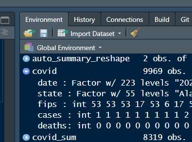

<script src="https://hypothes.is/embed.js" async></script>

```{r setup, include = FALSE, message=FALSE}
library(webexercises)
library(ggplot2)
knitr::opts_chunk$set(fig.path='../../../images/')
#knitr::opts_chunk$set(echo=FALSE)


part=function(reset=FALSE){
  if(reset){ pp <<- 0}
  pp <<- pp+1
  rr=letters[pp]
  
  return(rr)
}

part(TRUE)
part()

```


# Exercise 2.1

In the lecture we introduced R. The goal of this problem set is for you to work with R by yourself, so that you start to become comfortable with some basic commands, which will be needed throughout the course (and beyond?). Hence, even if you think you could answer a question with a different software package, could you please try using R?

In this exercise we are using a dataset called `auto.csv`. It contains various characteristics for a sample of cars.
You can download this dataset from [here](https://www.dropbox.com/s/gm22o5efboc3q0w/auto.csv?dl=1) from the course data repository. Note that a big part of working with data is to become familiar with different data formats. R can easily work with almost any dataformat imaginable but only if the user (i.e. you) gives it the right instructions. You are probably already familiar with the `.csv` format. But just in case not: `csv` stands for comma separated values. In other words: this is a table with arranged as a simple text file where rows represent table rows and the values that go into separate columns are separated by commas. 

To do anything with data you need get a dataset into a dataframe (essentially another word for table) in memory. For that you can first store it on your computer's harddrive and then  load it. You can do that using RStudio's import file menu very similar to how you would open an Excel worksheet, say:

```{r out.extra='style="max-width: 500px"', echo=F}
knitr::include_graphics("../../../images/fileimport.png")
```


### Part (`r part(TRUE)`)  
Instead of using the import dialog, can you load the dataset with an R command either from the console command line or via an R script?


`r hide("Hint:")`

If you use the RStudio dialog just discussed it will show you the R command that is needed in the Console window

`r unhide()`

`r hide("Answer:")`

```{r load auto, echo = TRUE}
auto <- read.csv("https://www.dropbox.com/s/gm22o5efboc3q0w/auto.csv?dl=1", header=TRUE)


```

Of course the exact formulation depends on where you saved your file on disk; i.e. it is unlikely it will be in a directory called `C:/Users/Ralf Martin/Dropbox/datastories/data/`.

Note that `header=TRUE` means that R can figure out the column names from the first line of the `auto.csv` file.
`r unhide()`


### Part (`r part()`)
Can you suggest an alternative version of the previous command with a relative path to locate the file?
`r hide("Answer:")`
```{r, echo = TRUE}
getwd()
```

To write a relative path you need to know which the current active directory is. With the `getwd()` command you can find out. In my case this happens to be the  `C:/Users/Ralf Martin/Dropbox/datastories/datastorieshub/_posts/exercises/exercises2` directory. Hence to get to directory `C:/Users/Ralf Martin/Dropbox/datastories/data` we need to go 4 directories up (to directory `C:/Users/Ralf Martin/Dropbox/datastories` ) and then down into the data directory. Note that you can use `..` to indicate to R that you want to move up one layer of the directory structure. Hence the corect command with relative path notation becomes:

```{r, echo = TRUE}
auto <- read.csv("../../../../data/auto.csv", header=TRUE)

```


`r unhide()`


### Part (`r part()`)
Probably the easiest way to load a web based CSV file into R is directly from the web. This can be achieved by using the file URL in the `read.csv` command. Can you work out how?


`r hide("Answer:")`
```{r, echo = TRUE}
auto <- read.csv("https://www.dropbox.com/s/gm22o5efboc3q0w/auto.csv?dl=1", header=TRUE)


```

You can figure out the URL by right clicking on a hyperlink.
`r unhide()`


### Part (`r part()`)
Describe the data set. 

How many observations does the data set have? `r fitb(nrow(auto))`

and how many variables does it have? `r fitb(ncol(auto))`

What variables are contained in the dataset?

`r hide("Hint:")`
R commands you might want to use for that include summary, nrow, ncol. You can try to type ?<name of function> in the RStudio console to learn more about the function. Alternatively, try googling and see how people use those functions.
`r unhide()`

`r hide("Answer:")`
```{r, echo = TRUE}
# Summary stats for all variables
summary(auto)

# Number of observations:
nrow(auto)

#Number of variables
ncol(auto)


#Just the names of all variables
names(auto)
```
`r unhide()`

### Part (`r part()`)
Much of the power of R derives from extensions (so called packages) that have been contributed to widen the capabilities of the basic software. A particularly nice extension are the dplyr and tidyr packages that allow vastly more efficient and transparent wrangling of data. Can you install those packages on your computer and load them into memory?


`r hide("Answer:")`
To install these packages use 
`install.packages("dplyr","tidyr")`

Note that you only need to do this once on a given computer (it's like installing software).
However, each time you re-start R you need to load the packages you want to use into memory again. For that you use

```{r,echo=TRUE}
library(dplyr)
library(tidyr)
```
`r unhide()`

### Part (`r part()`)
One of the great things included in those packages is the functionality of piping, which we shall be using extensively throughout this course. Piping allows you to send
the result from one R command to the next. This typically allows for more transparent code as you will hopefully appreciate maybe not just yet but sometime halfway through the course.

Just to give you an idea what piping does look at the code below. It does exactly the same as the `summary(auto)` command but we have now
written with the piping operator `%>%`. What it does is that it sends whatever comes on the left to the right (i.e. flushes it down the `%>%` pipe ). On the right hand side it is then being used as an argument to the code that comes there (hence we don't need to put anything in brackets in the summary command)

```{r,echo=TRUE}
auto %>% summary()
```

You can even do several of those pipes in a row. For instance, look at the following piece of code. Can you work out what it does?


```{r, echo=TRUE}
auto_summary <- auto %>%   select(mpg, weight)  %>% 
             summarise_all( list(mmm=mean,  p50=median, sd=sd  ) ) 

```

`r hide("Answer:")`

This piece of code takes first selects only 2 columns of the `auto` dataframe.
It sends this smaller dataframe with only 2 variables to the command
`summarise_all`. Summarise all will compute the statistics you mention within
`list(...)` for all the variables in the dataframe it is being given.
Note that in the list what comes after the `=` sign is the statistic you want whereas what comes before is a lable that will appear in the resulting 
dataframe, which we called `auto_summary`. You can look at it simply by typing 
its name in the console or a script:

```{r,echo=TRUE}
auto_summary

```

`r unhide()`


### Part (`r part()`)
The summary statistics in the previous part are not displayed very nice.
The dplyr and tidyr offer alot of nice functions to reshape any output
in whichever way you want. Below is a somewhat elaborate example. Below I am explaining step by step what it does. However, before you look at my explanation, maybe you can run those commands yourself step by step and figure what they do?

```{r, echo=TRUE}

auto_summary_reshape <- auto_summary %>% gather(stat, val) %>%
                    separate(stat, into = c("var", "stat"), sep = "_") %>%
                    spread(stat,val) 


```


`r hide("Explanation:")`

The code above reshapes the `auto_summary` dataframe so that it looks like this:

```{r, echo=TRUE}
auto_summary_reshape 
```


We can break this in all the steps to see how it does that:

```{r,echo=TRUE}

 step = auto_summary %>% gather(stat, val)
 step
```
The gather command arranges what you sent them down the pipe as key value pairs; i.e. 2 columns
where the first column is the key (i.e. a name or label) for the value that follows in the value column. `stat` and `val` are simply how we want to call those two columns


```{r,echo=TRUE}

 step = step %>% separate(stat, into = c("var", "stat"), sep = "_")
 step
```

The separate command splits the `stat` column in two new columns, `var` and `stat` where `sep="_"` tells R where to separate the original `stat` column.


```{r,echo=TRUE}

 step = step %>% spread(stat, val) 
 step
```

The spread command spreads out the stat column again; i.e. creates a new column for every category represented in stat. Alternatively, we could have spread var:


```{r, echo=TRUE}
auto_summary %>% gather(stat, val) %>%
                    separate(stat, into = c("var", "stat"), sep = "_") %>%
                    spread(var,val) 

```


`r unhide()`


# Exercise 2.2 
This github repository provides COVID related data for the US at the state and county level: [https://github.com/nytimes/covid-19-data](https://github.com/nytimes/covid-19-data) 


### Part(`r part(reset=TRUE)`)

Download the state level data (in csv format) from
        
[here](https://raw.githubusercontent.com/nytimes/covid-19-data/master/us-states.csv) and load 
it into an R dataframe. Have a look at the dataframe.
How many rows are there? What do the rows represent? What do the columns represent?

`r hide("Answer:")`


To load the dataset into a dataframe you can use:
```{r,echo=TRUE}
covid=read.csv("https://raw.githubusercontent.com/nytimes/covid-19-data/master/us-states.csv")

```
You can view the dataframe like an excel table by clicking on the name of the dataframe in the `Global Environment` tab, which also shows us the number of rows and columns of the dataframe (note that you might have a different number of rows as the dataframe is constantly updated online)
```{r out.extra='style="max-width: 400px"', echo=F}
knitr::include_graphics("../../../images/dflook.png")
```

We see that the dataframe contains daily COVID case and death numbers for every us state. Note that the numbers never reduce which suggests that these are cumulative figues (i.e. total number of cases and deaths up until a give day)


`r unhide()`


### Part(`r part()`) 

Compute the death rate (deaths over cases) for every state by July 31st, 2020 using R. Also add columns that contain the share of deaths in total deaths and the share of cases in total cases


`r hide("Answer")`

With `filter()` we can select specific rows of a dataframe. With `mutate()` we can create new variables in dataframe or modify exisitng ones. Note that the date variable is a factor variable. You can see this in the `Global Environment` tab:

```{r out.extra='style="max-width: 400px"', echo=F}

```

We will talk a lot about factor variables later in the course. For now it's enough to know that with the function `as.character()` you can convert the date variable from a factor to a character string which is necessary to compare it to character string such as "2020-08-01". As ever you can only compare like with like.

Hence, the following comand provides the result (note I am loading again the library dplyr which is not necessariy if you have done that already in this session)

```{r,echo=TRUE}
library(dplyr)


covid_july=covid %>% dplyr::filter(as.character(date)=="2020-07-31") %>%
          mutate(deathsOcases=deaths/cases,
                 deaths_sh=deaths/sum(deaths),
                 cases_sh=cases/sum(cases))

head(covid_july,10)

``` 

The `head()` command shows you the first couple of lines of a dataframe. That is useful if you wann a have a peek to examine larger dataframes.
`r unhide()`


### Part(`r part()`) 
Which is the state with the higest death rate (by July 31)? Can you work it out with an R command (rather than just looking through the table)?

`r hide("Answer:")`

```{r,echo=TRUE}
covid_july %>% filter(deathsOcases==max(deathsOcases))
          
```

`r unhide()`


### Part(`r part()`) 
Can you compute daily figures of deaths and cases for the US as a whole from the state level data? We haven't discussed all commands necessary for that yet. But see if you can work it out from checking online. If that takes too much time just check the answer below. As ever, ther are many different ways how could do that.

`r hide("Answer:")`

We can use the `group_by()` command which is par of dplyr. It allows to group rows of a dataframe by one (or several) categorical variables. We can then apply other commands that will be done seperately for each of those groups. In the case below we want to sum over all states for every day:


```{r}

usdaily=covid %>% group_by(date) %>% summarise(deaths=sum(deaths),cases=sum(cases))
head(usdaily)

```

`r unhide()`


### Part(`r part()`) 
Examine the US death rate over time. How would you expect this series to behave? How does it behave? How do you explain what you find?


`r hide("Answer:")`
The best way to do this is with a figure. We shall be talking in the next lecture a lot more about plotting. However, no harm done trying this out. There are a number of commands to plot something. However, the most versatile is the ggplot command. (You need to install and load the ggplot2 package before you can use it.). Also: things will look better if you tell R that the date column is date. We can do this with the `as.Date()` command.

Couple of words about the ggplot command: 

- You start by telling R which dataframe to use (`usdaily`)
- with `aes()` for aesthetic you declare which variables to use for x and y axis.
- By adding further commands with a `+` sign you control how things look; e.g. that you want to see points (`geom_point()`) and that you want monthly date labels.


```{r}
library(ggplot2)

usdaily=usdaily %>% mutate(date=as.Date(date), deathsOcases=deaths/cases)
ggplot(usdaily, aes(x=date, y=deathsOcases)) +
      geom_point() + 
      scale_x_date(date_breaks="1 month",date_labels = "%b")
  


```


Now what do we expect to find?
To die from COVID you have te get sick and it will take at least a couple of days. Hence, we would expect to see death rates to be low at first and then to increase. Over time we would hope that doctors get better at treating COVID patients. Also, people who know they are at risk will increasingly shielding so that the only people who get sick will be those who are less likely to die. Both factors should bring the death rate down after an initial peak. This is what we are seeing when only looking at the series from the end of March onwards with a peak in mid May.
However, there is a first peak in early March. What could explain this? The most plausible explanation is probably measurement error: early on cases of infections where probably not counted properly as there was no systematic way of testing the population. On the other, if somebody was so ill that they die this would almost certainly be picked up by the authorities. Hence death figures were not under counted. Also, early on numbers were low. So a couple of counts too few for cases could easily swing the ratio.
[Here](https://www.ft.com/content/c011e214-fb95-4a64-b23c-2bd87ebb29d7?utm_source=pocket-newtab-global-en-GB) is some further discussion of this.


`r unhide()`


### Part(`r part()`) 
A large part of data analysis work is getting the data into a format that lends itself to analysis. And a very big part of that is the process of combining datasets from different sources. Here we start learning how this can be done in an efficient way.
[Here]("https://www.dropbox.com/s/tp4kiq8if372rcz/populationdata.csv?dl=1") you find a dataset in csv format with information on the size (in terms of population) of different US states. Can you combine this with the COVID case count dataframe for US states at the end of July that we created earlier?


`r hide("Answer:")`

First you need to load the population dataset into a dataframe as well:

```{r}
pop=read.csv("https://mondpanther.github.io/datastorieshub/data/populationclean.csv")
 

```


To combine the two dataframes we can use a command called `merge()`:

```{r}
covid_julyb=covid_july %>% merge(pop,by="state", all.x=TRUE)

```

This tells R to create a new dataframe (`covid_julyb`) by combinig the information in `covid_july`
and `pop`. Rows are being matched using the variable `state`. Maybe you noted that pop has only 52 observations whereas `covid_july` has 55. This is because `pop` doesn't include information on places such as Guam and a couple of other Islands that are not formal US states but controlled by the US, whereas `covid_july` does. The `all.x` option tells R to keep observations from the first dataset (i.e. `covid_july`) even if no equivalent observation in the second dataset can be found. This is also known as a left join. Similarly there is a right join with `all.y=TRUE` or a full join with `all=TRUE`. You might want to read a bit more about the merge command e.g. [here](https://www.dummies.com/programming/r/how-to-use-the-merge-function-with-data-sets-in-r/)


`r unhide()`


### Part(`r part()`) 
Using the newly created dataframe create a new variable COVID cases per capita (i.e. per head of population).
Explore the relationship between per capita cases and population density. What kind of relationship would you expect? What do you find?

`r hide("Answer:")`

Add per capita cases with mutate (to make things easier to read we use cases per 1000 of population):

```{r}

covid_julyb=covid_julyb %>% mutate(casesOpop000=cases/pop*1000)


```

We would we expect a positive relationship between per capita cases and density: if 


A scatter plot is usually the best way to get going on a question like this. We can once more use the ggplot command (geom_smooth(method=lm) adds a regression line):


```{r}

usdaily=usdaily %>% mutate(date=as.Date(date), deathsOcases=deaths/cases)
ggplot(covid_julyb, aes(x=density, y=casesOpop000 ))+ 
      geom_point() + geom_smooth(method=lm)
  
```


Dropping the outlier on the right (i.e. Washington DC which is not really a State)

```{r}
ggplot(covid_julyb %>% filter(density<6000), aes(x=density, y=casesOpop000 ))+ 
      geom_point() + geom_smooth(method=lm)
```


Hence, there is clearly a positive relationship between density and covid cases. It becomes more pro-nounced when dropping Washington DC.
This is also confirmed when looking at the parameters of the regression line directly, which we can do with the lm() command.

```{r}
summary(lm(casesOpop000~density,covid_julyb  %>% filter(density<6000) ))
```

`r unhide()`


### Part (`r part()`)
Computers - unlike humans - are good at doing repeated tasks reliably without frustration. A basic way to accomplish that in a programming language are are loops. 
Let's look at a concrete example. Suppose you want to create time series figures of COVID death rates for several US states: California, Texas, New York and Alaska, say. 
Try if you can work out how to do that with a for loop using the help function and online googling.
If your are stuck check out the answer below.

`r hide("Answer:")`


Let's start by arranging the states in a collection. Also add a death rate column to the covid dataframe (and clear up the date variable):

```{r}
states=c("California","Texas","New York","Alaska")

covid=covid%>% mutate(deathsOcases=deaths/cases, date=as.Date(date))

```


Now loop over those states:

```{r}

for(s in states){
  print(s)
  p=ggplot(covid  %>% filter(state==s), aes(x=date, y=deathsOcases)) +
      geom_point() + ggtitle(s)
      scale_x_date(date_breaks="1 month",date_labels = "%b")
  
  print(p)
}

```

It's interesting to see quite a variation in the shape of this series between different states. New York hasn't managed a meaningful decline in death rates. In Texas on the other hand death rates are increasing again after a substantial decline in July.


`r unhide()`


# Exercise 2.3
### Part (a)
Besides analysing data we can use R to make up data. Why would we do that? It's a common approach called "Monte-Carlo Analysis". If we make up the data we know the underlying model that is driving the data. We can use to this to test the methods we are using. Do they lead us to the true underlying model or do they have biases that give us the wrong answer? 
In this exercise we walk through how this can be done in a simple case. As ever: try to work through all of this while creating an R script or R markdown file.
First we need to decide about the sample size. 	Let’s use a sample of size 100. It makes sense to assign this number to a variable as follows:

```{r}
obs<-100
```


Assume that the data is driven by the following true model $Y=2+0.5 X +\epsilon$ where $\epsilon$ is a random variable that follows a standard normal distribution; i.e. its distribution follows the famous bell curve. Using R you can draw realisations  of such a random variable using the function `rnorm()`
To assign those values to a variable called `eps` we can write
 
```{r} 
df=data.frame(eps=rnorm(obs))
```
where the `data.frame` command arranges the newly created variable eps into a dataframe rather than being standalone.

Similarly we can generate the explanatory variable X as:

```{r}
df=df%>% mutate(X=runif(obs))
```

This will draw the values of X by drawing random variables on the interval between 0 and 1 with uniform (i.e. all values have the same) probility.
Look at the values of X and $\epsilon$. Here are the first 10:

```{r}
head(df,10)
```


### Part (b)
Now create the Y variable according to the formula above.

`r hide("Answer:")`
```{r}
df=df%>% mutate(Y=2+0.5*X+eps)
```

`r unhide()`

### Part (c)
Run a regression of Y on X. What value do you find for the coefficient on X? Would you think this is an unbiased estimate?


`r hide("Answer:")`
```{r}
  
    reg=lm(Y~X,df)
    summary(reg)
  

```
`r unhide()`


### Part (d)

Now use a “for”-loop to repeat the steps from section (a)-(c) 1000 times. 


We can do this in R with the following for-loop command


`for(i in 1:1000) {`

  `<several lines of code >`

`}`


i.e. the lines of code between the first line and `}` will be repeated 1000 times. The variable `i` will increase by 1 on each round. 

`r hide("Answer:")`

```{r}
beta <- double(1000)
for(i in 1:1000){
    
    #print(i)
    
    df=data.frame(eps=rnorm(obs))
    df=df%>% mutate(X=runif(obs))
    df=df%>% mutate(Y=2+0.5*X+eps)
    #print(lm(Y~X,df)$coefficients[[2]])
    beta[i]<-lm(Y~X,df)$coefficients[[2]]
}

```

Note: with `$coefficients[[2]]` we extract the coefficient estimate of the second (i.e. the slope) coefficient from the
regression results and store it in a vector called `beta`


`r unhide()`

### Part (e)
Compute the average value of the estimate of the X coefficient across the 1000 repetitions.


`r hide("Answer:")`

```{r}

mean(beta)

results=data.frame(beta)
ggplot(results, aes(x=beta)) + 
       geom_histogram(color="black",fill="white",bins=40) + 
       theme_minimal()

```

Note: we can use ggplot to draw a histogram of all the results for beta as well.
This shows that while we not always get a value close to 0.5, over many replications the value we find are centered around the true value of 0.5


`r unhide()`


