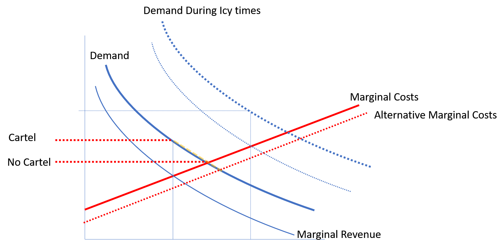

```{r  fig.width=30,echo=F,preview=TRUE,out.width = '80%'}
knitr::include_graphics("20131205_Istanbul_321_cropped.jpg")
```


```{r setup, include = FALSE}
knitr::opts_chunk$set(echo = TRUE)
if (!requireNamespace("webex")) {
  stop("You must have the 'webex' package installed to knit HTML from this template.\n   devtools::install_github(\"psyteachr/webex\")")
} else {
  library("webex")
}
library(car)
library(plm)
library(AER)
library(ivpack)
library(ggplot2)
```


# Exercise 7.1

Use the dataset4.dta dataset. It contains weekly prices for rail transport of grain in the US midwest during the 1880s, and the quantity shipped. The railroad companies at the time operated a cartel, called the Joint Executive Committee (JEC), which is believed to have raised prices above the level that would have otherwise prevailed. This practice was legal before the Sherman Act of 1890 (antitrust legislation) was passed. From time to time, cheating by cartel members brought about a temporary collapse of the collusive price setting agreement. A dummy variable – “cartel”- in the data set indicates the period when price fixing was in effect. 

```{r }
library(haven)
d4=read_dta("https://www.dropbox.com/sh/rqmo1hvij1veff0/AABQXwWvdZdvGlT6Y8LIfoMha/dataset4.dta?dl=1")
names(d4)
```

### Part (a)

Run an OLS regression of the log quantity on the log price, controlling for ice, indicating that the Great Lakes were frozen preventing transport by ship, and a set of seasonal dummy variables (to capture seasonality in demand; note that dataset has 12 seasonal dummies; i.e. they tread every month as a season). 

What is the estimated price elasticity? `r fitb(-0.64)`

Do you think you are estimating a demand curve? Explain. `r mcq(c("No", answer = "Yes"))`

Think of what the the economic rationale is of including the variable “ice” in the regression?

`r hide("Answer:")`

```{r }
m1=lm(log(quantity)~log(price)+ice+seas1+seas2+seas3+seas4+seas5+seas6+seas7+seas8+seas9+seas10+seas11+seas12, data=d4)
coeftest(m1, vcov=vcovHC)
```

The regression implies a price elasticity of -0.64; i.e. a 1% increase in price will lead to a 0.64% reduction in demand.
We can interpret this as a demand curve, if the price coefficient really represents the effect of a price change on demand holding all other things constant. 
One reason why this might not be the case is if shocks to demand cause price changes. On the other hand if we can control for big potential shocks to demand it will be possible to recover un-biased estimates. A big potential demand shock here is the freezing of the lakes: Because rail transport becomes the only option and hence demand increases it might lead to price changes. Indeed we see that “ice” has a significant positive effect on demand.


`r unhide()`

### Part (b)

Consider using cartel as an instrument for price in order to identify the demand curve. 

Is the instrument is likely to satisfy the conditions for a valid instrument? `r mcq(c("No", answer = "Yes"))`

Can you use the data to check these conditions? `r mcq(c("No", "Yes", answer = "Somewhat"))`

`r hide("Answer:")`

Exogenous? Having a cartel is clearly a supply side factor that will by and large depend on the number of firms in the market and their respective manager's ability to strike a deal, all factors un-related to demand.  However, the incentive to form a cartel is also driven the amount of money to be made from having a cartel which is a demand side factor. Having said that, it is more likely that long term structural aspects of of demand are relevant for this rather than the weekly changes over a relatively short time period (6 years). Hence, it is plausible that we can use cartel as an IV.

Driving explanatory variable? It is almost the definition of a cartel that it has a positive impact on price. At any rate this is something we can check via a first stage regression.

Exclusion? It is fairly plausible that the main effect of cartel on demand is via price. However, we can also imagine scenarios where the exclusion restriction might not hold in such a setting: imagine that the mere fact that the industry forms a cartel leads to some kind of negative press and consumer backlash perhaps with a boycott. Having said that, this is probably more of a concern with consumer goods rather than railway cargo transport.


`r unhide()`

### Part (c)

Estimate the first stage and reduced form equations. 

What is the effect of cartel on price in the first stage?  `r mcq(c("Not significant", answer = "Significant"))`

What is the effect of cartel on price in the reduced form?   `r mcq(c("Positive", answer = "Negative"))`

`r hide("Answer:")`

First stage suggests highly significant effect of cartel on price.

```{r }
fs=lm(log(price)~cartel+ice+seas1+seas2+seas3+seas4+seas5+seas6+seas7+seas8+seas9+seas10+seas11+seas12, data=d4)
coeftest(fs,vcov=vcovHC)
linearHypothesis(fs,"cartel=0")
```

Reduced form shows strong negative effect of cartel on price as would be expected.

```{r }
rf=lm(log(quantity)~cartel+ice+seas1+seas2+seas3+seas4+seas5+seas6+seas7+seas8+seas9+seas10+seas11+seas12, data=d4)
coeftest(rf,vcov=vcovHC)
```


`r unhide()`

### Part (d)

Estimate the demand function by IV. What is your estimated demand elasiticity?  `r fitb(-0.86)`

How does it differ from your OLS estimate in (a)? `r mcq(c("More positive", answer = "More negative"))`

`r hide("Answer:")`

IV regression suggests a price elasticity of -0.86; i.e. the estimate has become stronger (more elastic; i.e. more negative) compared to OLS. This is consistent with positive demand shocks in exerting a positive influence on price (i.e. the OLS estimate would be biased upward so that it becomes less negative than is true in reality)

```{r }
library(AER)
iv=ivreg(log(quantity)~log(price)+ice+seas1+seas2+seas3+seas4+seas5+seas6+seas7+seas8+seas9+seas10+seas11+seas12| cartel+ice+seas1+seas2+seas3+seas4+seas5+seas6+seas7+seas8+seas9+seas10+seas11+seas12, data=d4)
robust.se(iv)
```

`r unhide()`

### Part (e)

Microeconomic theory suggests that a monopolist (like the cartel) should operate in a region of the demand curve where demand is elastic (i.e. the elasticity is <= -1). The estimate in c) is clearly larger than -1. Can we therefore conclude in a statistically significant way that the demand curve is in-elastic and therefore at odds with economic theory?

`r mcq(c(answer="No",  "Yes"))`

`r hide("Answer:")`
The estimated elasticity is -0.8 in the IV result and thus larger than -1 and therefore non-elastic. That said, we know that even if the demand is actually ealstic (i.e. <=-1) we might still end up with an in-elastic estimate when estimating the 
elasticity from a sample of data. More formally we might want to test the hypothesis that the demand curve is equal to -1 (i.e. the highest value that would still allow to claim it is elastic) againts the alternative that it is in-elastic; i.e.

Hence we are tesing $H0: \beta(lnprice)=1 \textrm{ vs } H1: \beta(lnprice)>-1$. Note that this is  a one sided test, implying that we are only worried about being wrong if the value is larger. This only affects which critical threshold we require. For a 5% significance level we don't need to divid 5% by 2 to find the threshold. Rather, the threshold becomes: qnorm(0.95)=`r qnorm(0.95)`.
Hence, we would reject that our demand is in-elastic if we find that our t-value is larger than this threshold. We can calculate our t-value here as:

$$t-stat=(-0.8666+1)/0.131= 1.0204783$$


which is not bigger than `r qnorm(0.95)` , so we cannot reject the hypothesis that we are actually dealing with an in-elastic demand curve.

As further illustration for this exercise consider also the following diagram:
{width=80%}
Note that we can work out the shape of a demand curve if we know that the demand curve stays fixed and prices vary for reasons other than shifts in demand (such as a shifts in marginal costs or price increases
due to monopoly/cartel power). However, in practice we don't know what exactly moved prices and demand from one datapoint to the next. We can make progress by controlling for (some) of the stuff that clearly will
shift demand (e.g. ice preventing alternative forms of transport). In addition we can focus exclusively on price movements that are brought about by supply side price movements if we have variables (such as the 
existence of a Cartel) that we can assume to be exclusively driving the supply side.

`r unhide()`


