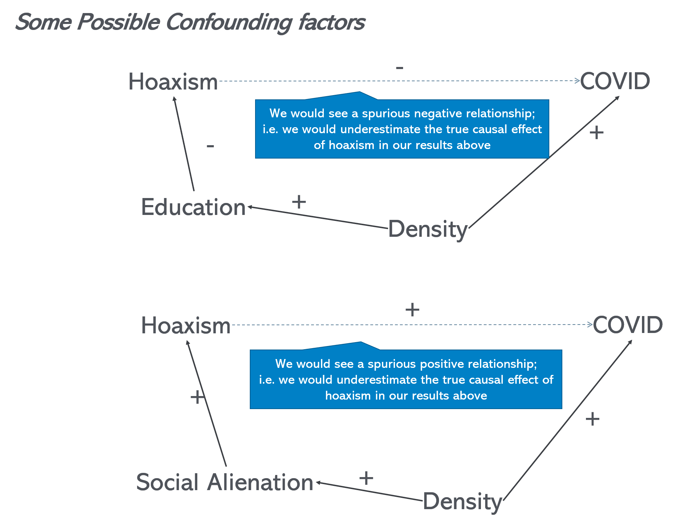

Last update:  `r format(Sys.time(), '%B %d , %Y - %H:%M ')`


# Introduction


This document (you find the Rmd file for this document under [this](https://mondpanther.github.io/datastorieshub/code/CourseworkGuide.Rmd) link) provides you with a template or (draft) example of how your submission could look like.

In terms of length and format: Think of this as something snappy that could be turned into a blog post or similar. Try to keep it below 2500. If you have a lot more to say try to work out the most important points that can be put within that limit and put anything else in an appendix.
Please submit a final document as well as any underlying code (i.e. the RMD or R file(s)). Also submit the dataset(s) you are using or provide links if the data is stored online.

You should start with an introduction that motivates what you are working on. What question or issue are you going to address? 
0
Here we are going to look into COVID Hoaxism i.e. the phenomenon that people question the reality of the covid pandemic. Specifically, we explore the hypothesis that such hoaxism has made the pandemic worse i.e. that there is a causal link from hoaxism to covid cases and/or deaths. A mechanism that would support this is that people don't observe social distancing or use face coverings because they don't believe that the pandemic is happening.


# Methods and data

Explain how you are going to provide evidence on your chosen topic i.e. what kind of model you will try to fit and what kind of data you are going to use. Also briefly describe how you got the data unless it is obvious. Just give a broad brush idea and reserve any intricate details to an appendix. However, focus on aspects of your data that might have an impact on your discussion and key results (e.g. see example below).


For the case of covid hoaxism we are fitting a model of the following form:
$$ Y_i=\beta_1 HOAX_i + \beta_2 X_i + \epsilon_i$$ 
where $Y_i$ are different outcome variables such as COVID cases and deaths per capita, $HOAX_i$ is the share of hoax tweets (in percent). $X_i$ are various sets of control variables.  We are using data for US states for the period from January to September of 2020. Data on covid outcomes comes from an online repository of the New York times, more details [here](https://github.com/nytimes/covid-19-data). To measure the degree of hoaxism we sample tweets using various Twitter APIs. [Here](https://medium.com/@traffordDataLab/exploring-tweets-in-r-54f6011a193d) is a nice discussion how this can be done with R. Since March 2020 we have regularly been sampling tweets that mention the strings `covid` or `corona`. To measure hoaxism we divide the tweets with a `#covidhoax` or `#coronahoax` hastag by the total number of tweets. 

Note that in this way we most likely underestimate the amount of actual hoax tweets as not all hoaxers will necessarily hastag their tweets in this way. However, our main point will be to compare our measure between US states. Hence, unless we are concerned that this underestimate varies systematically between states this shouldn't have much effect on our results.


```{r setup, include=FALSE}
knitr::opts_chunk$set(echo = TRUE)

library(rtweet)
library(tidytext)

# plotting and pipes - tidyverse!
library(ggplot2)
library(dplyr)
library(gdata)


```


```{r load some data, include=FALSE, message=FALSE,echo=FALSE}
# Note that by writing 'include=FALSE' you avoid hat the code is shown in final output

stats=read.csv("https://www.dropbox.com/s/8w4zbg40y84pnqk/statslong.csv?dl=1")

# Creating some extra variables
stats=stats%>%mutate(   pop=pop/1000, 
                        hoaxshXdensity=(hoaxsh)*(density-mean(density)),
                        tweetsPCXdensity=(tweetsPC)*(density-mean(density))
                      )


```


# Results

Report and discuss your results e.g. we start by looking at a scatter plot of deaths per capita on the hoaxism share:

```{r simple scatter, echo=FALSE,message=FALSE}


ggplot(stats,aes(x=hoaxsh, y=deathsPC))+
  geom_point()+theme_minimal()+ylab("Deaths per capita")+xlab("Hoaxism share in %")+
  geom_smooth(method="lm")+ggtitle("Covid deaths vs Hoaxism")


```

The plot suggests a positive relationship i.e. more hoaxism is associated with more deaths. We can confirm this with a regression:


```{r regressions,echo=FALSE}
library(dplyr)
reg1=lm(deathsPC~hoaxsh,stats) 
reg1 %>% summary()
```

The regression result would suggests that 1 percentage point increase of the hoaxism intensity of a shate leads to `r round(reg1$coefficients[[2]],3)` more deaths per 1000 people in a state.

This basic result might be subject to a number of confounding factors that might either bias the results upward or downward. For instance, population density could be an important driver of both the spread of covid and hoaxism intensity. For instance, more rural (and less denseley populated areas) could have less educated residents who might be more inclined to adopt hoaxist views. This would introduce a spurious negative relationship between hoaxism and covid, implying that our results above would underestimate the strength of the hoaxism-covid relationship. Alternatively, it might be the case that among city dwellers more individuals are socially alienated and get more easily sucked into online cults and conspiracy theories. This would introduce a positive spurious relation between hoaxism and covid leading to an upward bias in our simple analysis above. The figure below illustrates this:

{width=70%}


Hence a good idea is to introduce population density (measured in person per square mile) as control variable. We do this in the following regression:

```{r,echo=FALSE}
reg2=lm(deathsPC~hoaxsh+density,stats) 
reg2%>% summary()

```

We firstly find that there is a significant positive relationship between density and covid deaths as would have been expected. Secondly, we see that the hoaxism-covid relationship remains significant and is now quantitatively stronger (i.e. a one percentage point increase in hoaxism is associated with a `r round(reg2$coefficients[[2]],3)` increase of covid deaths per 1000 residents), which would be consistent with the negative bias story (via education) suggested above.

There are clearly further concerns to explore. For instance with the data we already have we can easily include a further control variable - the number of tweets per capita. This could be another control for confounding influences such as education for instance, which might be only impefectly captured by population density e.g. states with more educated people will have higher internet (and twitter) usage. The resulting regression is as follows:

<br>

```{r}

reg3=lm(deathsPC~hoaxsh+density+tweetsPC,stats) 
reg3%>% summary()

```


We see two things in particular:
1.) Tweets per capita do not have a significant influence on deaths.
2.) The hoaxism effect remains virtually unchanged. In other words, it is robust to this small modification in the model, which is re-assuring.
<br>

The fact that the relationship is significant doesn't mean it is necessarily important. To get a sense of the order of magnitude we can work out how much lower covid deaths for the US as a whole would be if our estimate above is true reflection of the causal effect of hoaxism. We can use our model to work out how many lives would have been saved in a given US state $i$ in absence of hoaxism by calculating
$$ \Delta Deaths^{CF}_i=\hat{\beta_1} \times HOAX_i \times POP_i$$
where $\Delta Deaths^{CF}_i$ is the (counterfactual) number of deaths avoided and $POP_i$ is a state's population.
Summing over all states we can work out the total number of deaths that could have been avoided in the US.


```{r, echo=FALSE}
# When doing something like this be mindful of the units
# pop is in 1000s of people
# deathsPC is deaths per 1000s of people
# deaths is the number of deaths


cf_Ddeaths=as.character(round(sum(stats$hoaxsh * stats$pop) * reg3$coefficients[[2]]))
sum_deaths=sum(stats$deaths)


```

This leads to a value of `r cf_Ddeaths`, which corresponds to `r round(as.numeric(cf_Ddeaths)/sum_deaths*100,1)` % of deaths over the sample period considered here. This is clearly substantial. Of course, there are still many possible confounding factors that should be explored but a figure like that is at the very least a strong motivation for further research in this area.


# Conclusion

There are many different things one could or even should try. Clearly, there are other useful control variables. One could explore the interaction between hoaxism and density as we did during the visualisation lecture. One could look at time series data for individual states and see if flare ups in infection are somehow related to flare ups in hoaxism. However, a basic analysis and discussion as done here would be a good group coursework piece along with a conclusion along the following lines:

Hoaxism and related misinformation are an increasing concern for the functioning of democracy, our well being and economics. In the case of the covid pandemic, misinformation has potentially immediate deadly consequences. Here we explored the link between hoaxsim and covid deaths across US states. We found a robust and significant relationship between hoaxism and covid deaths. We also find that the relationship quantitatively meaningful. If we take the numbers at face value they imply that without hoaxism as much as 30% of US COVID deaths could have been avoided. Clearly this figure should be subjected to further scrutiny - e.g. by using more sophisticated empirical models - but it is clearly a strong motivator to understand the mechanisms behind COVID hoaxism better.


