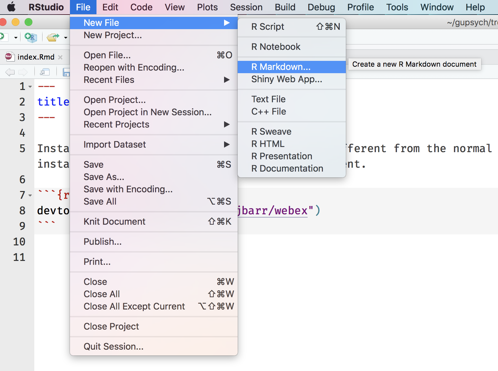

```{r setup, include = FALSE, message=FALSE}
library("webex")
library(ggplot2)
knitr::opts_chunk$set(fig.path='images/')
```

Dale and Lisa are developing an R package called [`webex`](https://github.com/dalejbarr/webex) to make it easier to make web-based exercises. It provides an RMarkdown template and a few functions to make questions that automatically give feedback and hint or solution buttons.

Create fill-in-the-blank questions using `fitb("4")`, providing the answer as the first argument.

- 2 + 2 is `r fitb("4")`

You can also create these questions dynamically, using variables from your R session.

```{r, eval=F}
x <- sample(2:8, 1)
fitb(x)
```

```{r, echo=F}
x <- sample(2:8, 1)
```

- The square root of `r x^2` is: `r fitb(x)`

The blanks are case-sensitive; if you don't care about case, use the argument `ignore_case = TRUE`.

```{r, eval = F}
fitb("E", ignore_case = TRUE)
```

- What is the letter after D? `r fitb("E", ignore_case = TRUE)`

You can set more than one possible correct answer by setting the answers as a vector. 

```{r, eval = F}
fitb(c("A", "E", "I", "O" , "U"), ignore_case = TRUE)
```

- Type a vowel: `r fitb(c("A", "E", "I", "O" , "U"), ignore_case = TRUE)`

If you want to ignore differences in whitespace use, use the argument `ignore_ws = TRUE` and include spaces in your answer anywhere they could be acceptable. Note, you need to escape double quotes inside of a quoted string using a backslash like this: `"I am using \"quotes\" in my quoted string"`.

```{r, eval = F}
answers <- c(
  "library( tidyverse )", 
  "library( \"tidyverse\" )"
)
fitb(answers, ignore_case = TRUE, width = "20")
```

- How do you load the tidyverse package? `r fitb(c("library( tidyverse )", "library( \"tidyverse\" )"), ignore_case = TRUE, width = "20")`

Create multiple choice questions using `mcq(c(answer = "correct answer", "incorrect 1", "incorrect 2"))`.

```{r, eval = F}
lyrics <- c(
  answer = "let you down", 
  "let you go", 
  "turn you down", 
  "run away"
)
mcq(lyrics)
```

- "Never gonna give you up, never gonna: `r mcq(c(answer = "let you down", "let you go", "turn you down", "run away"))`"

- "I `r mcq(c("left the reigns", answer = "bless the rains", "guess it rains", "sense the rain", "bless the waves"))` down in Africa" --Toto

If your options are just true or false, you can make a quick MCQ with `torf(TRUE)` or `torf(FALSE)`

- You can permute values in a vector using `sample()`. `r torf(TRUE)`

Webex also lets you make hidden solutions and hints by surrounding the hint or answer with `hide("Button Text")` and `unhide()`.

- Recreate the scatterplot below, using the built-in `cars` dataset.

```{r cars-plot, echo = FALSE}
ggplot(cars, aes(speed, dist)) +
  geom_point() +
  geom_smooth(method = "lm", color = "red") +
  ylab("distance")
```

`r hide("I need a hint")`
`?geom_smooth`
`r unhide()`

`r hide()`
```{r eval = FALSE}
ggplot(cars, aes(speed, dist)) +
  geom_point() +
  geom_smooth(method = "lm", color = "red") +
  ylab("distance")
```
`r unhide()`

<br><br>

## Getting Started

1. Install webex from github. This is a little different from typical installation, since the package is in development. Just use the code below.

```{r install-webex, eval = F}
devtools::install_github("dalejbarr/webex")
```

2. Create a new RMarkdown file

```{r out.extra='style="max-width: 500px"', echo=F}

```

3. Select the "Web Exercises" template.

```{r out.extra='style="max-width: 500px;"', echo=F}
knitr::include_graphics("images/webex_template.png")
```

4. Edit the template with your content. Leave the `setup` chunk of code at the top.

5. Knit to HTML

```{r out.extra='style="max-width: 500px"', echo=F}
knitr::include_graphics("images/knit_webex.png")
```

6. Open the new .html file in your web browser.

You can publish your html files on any web server, or set up a website on github using our instructions for [creating an academic website](/acadweb/).
